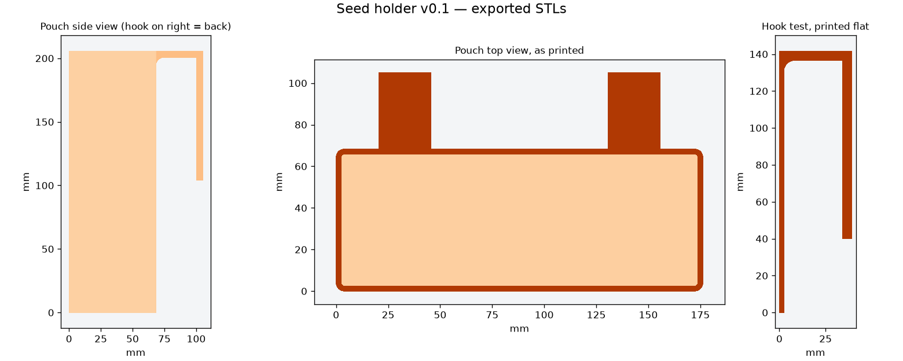

# v0.1 — first draft from the sketch

**Print `hook_test.stl` first.** It checks the bucket rim fit in about an hour, before you spend a full day and about 0.37 kg of filament on the pouch.



## Print and test

Print at **100% scale** in the supplied orientation.

1. **hook_test.stl** — 39 × 142 × 15 mm, printed flat on its side, with no supports.
   It has one hook (31.75 mm throat, 101.6 mm leg) and a strip of back wall.
   Hang it on the bucket. Check that the rim slides in without force, that it
   doesn't rock or slip, and that the leg sits well against the other side of the wall.
   If the throat is loose or tight, change `hook_gap`; for the leg, change `hook_drop`.
2. **pouch.stl** — 176.3 × 105.1 × 205.6 mm, printed **upright, open end up**.
   It has two 25 mm wide hooks on the back. **Their legs start in mid-air, so enable
   supports under the two hook legs only**; tree supports "touching build plate"
   work best. Keep supports out of the pouch interior.
   The full walls are 2.4 mm thick (6 perimeters at 0.4 mm), so infill barely
   matters. Expect roughly 0.37 kg of PLA/PETG and a long print. Check the time in your slicer.

After printing, put in a medium freezer bag full of seeds and check:

- the bag slides in and out, and the zipper sits where you want it
- the hooks hold the loaded weight without bending
- the pouch hangs straight and doesn't swing into anything

## Parameters (`seed_holder.scad`)

| Name | Default | Meaning |
|---|---:|---|
| `inner_w`, `inner_d`, `inner_h` | 171.45, 63.5, 203.2 | Inside pouch size (6.75 × 2.5 × 8 in) |
| `wall`, `floor_t` | 2.4, 2.4 | Wall and floor thickness |
| `hook_gap` | 31.75 | Clear throat between the pouch back and the hook leg (1.25 in) |
| `hook_drop` | 101.6 | Hook leg length, measured from the top (4 in) |
| `hook_t`, `hook_w` | 5, 25 | Hook thickness and width |
| `hook_x` | [-55, 55] | Hook centers from the middle of the pouch |

The asserts reject any part that exceeds the 220 × 220 mm bed (with a 10 mm brim allowance) or 250 mm of Z.

## Reproduce

```sh
python export_models.py    # needs OpenSCAD
python validate_meshes.py  # needs NumPy; writes mesh_checks.json
python make_preview.py     # needs Matplotlib; writes preview.png
```

`mesh_checks.json` records closed oriented edges, triangle validity, one connected
body and bed/Z bounds. It does not certify strength, bag fit or bucket fit.
